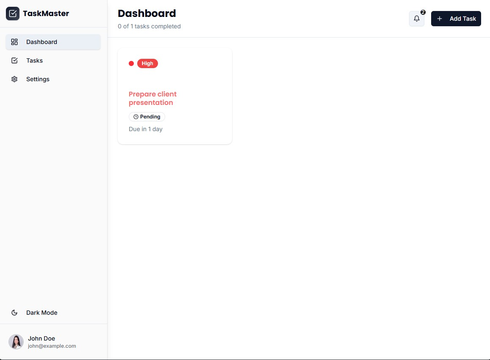
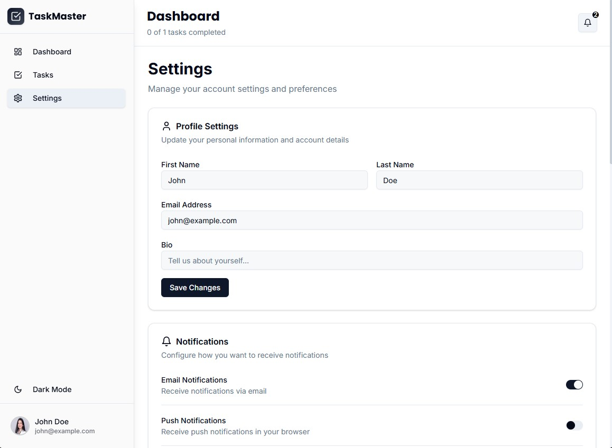
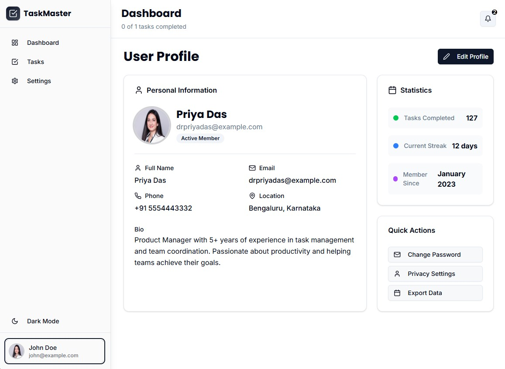

# TaskMaster Dashboard

A modern, responsive task management application built with Next.js and React, featuring a clean UI, dark mode support, and comprehensive task management capabilities.

## Screenshots

## Features

- **Task Management**: Create, edit, delete, and mark tasks as complete
- **Priority System**: Visual priority indicators (High: Red, Medium: Yellow, Low: Green)
- **Dark Mode**: Simple toggle-based dark/light theme switching
- **Responsive Design**: Optimized for desktop, tablet, and mobile devices
- **Real-time Notifications**: Interactive notification system with dropdown
- **User Profile**: Comprehensive profile management page
- **Settings Panel**: Configurable app preferences and account settings
- **Local Storage**: Persistent task storage across browser sessions
- **Smooth Animations**: Staggered task animations and smooth transitions

## Architecture

### State Management
The application uses **React Context** with `useReducer` for centralized state management:

\`\`\`
contexts/
├── app-context.tsx     # Global state management with AppProvider
\`\`\`

**Key Decision**: Chose React Context over external libraries (Redux, Zustand) for simplicity while maintaining scalability. The context manages:
- Task CRUD operations
- UI state (sidebar, modals, current view)
- Dark mode preferences
- User profile data

components/
├── ui/ # Reusable UI components (shadcn/ui)
├── header.tsx # Top navigation with notifications
├── sidebar.tsx # Navigation sidebar with theme toggle
├── task-card.tsx # Individual task display component
├── task-grid.tsx # Task layout and filtering
├── add-task-form.tsx # Task creation form
├── user-profile.tsx # User profile management
└── settings.tsx # App settings panel

**Key Decision**: Adopted a component-first architecture with clear separation of concerns. Each component handles its own presentation logic while relying on context for state.

### Styling Approach
- **Tailwind CSS**: Utility-first CSS framework for rapid development
- **shadcn/ui**: High-quality, accessible component library
- **Custom CSS Variables**: Theme-aware color system for dark/light modes

**Key Decision**: Used Tailwind's utility classes combined with CSS custom properties for theme switching, avoiding complex CSS-in-JS solutions.

### Dark Mode Implementation
Implemented a **simple toggle-based approach** instead of complex theme libraries:

\`\`\`javascript
const toggleDarkMode = () => {
  const newMode = !isDarkMode;
  setIsDarkMode(newMode);
  document.documentElement.classList.toggle('dark', newMode);
  localStorage.setItem('darkMode', newMode.toString());
};
\`\`\`

**Key Decision**: Chose simplicity over feature-richness. This approach provides reliable theme switching without hydration issues or complex dependencies.

## Technology Stack

- **Framework**: Next.js 14 (App Router)
- **Language**: TypeScript
- **Styling**: Tailwind CSS v4
- **UI Components**: shadcn/ui
- **Icons**: Lucide React
- **State Management**: React Context + useReducer
- **Storage**: localStorage for persistence

## Key Development Decisions

### 1. Component Architecture
- **Single Responsibility**: Each component handles one specific concern
- **Composition over Inheritance**: Built reusable components through composition
- **Props Interface**: Strongly typed interfaces for all component props

### 2. State Management Strategy
- **Centralized State**: All application state managed through React Context
- **Action-Based Updates**: Used reducer pattern for predictable state changes
- **Local Storage Integration**: Automatic persistence without external dependencies

### 3. Responsive Design
- **Mobile-First**: Designed for mobile devices first, then enhanced for larger screens
- **Flexible Layouts**: Used CSS Grid and Flexbox for adaptive layouts
- **Collapsible Sidebar**: Space-efficient navigation for smaller screens

### 4. Performance Optimizations
- **Lazy Loading**: Components load only when needed
- **Minimal Re-renders**: Optimized context structure to prevent unnecessary updates
- **Local Storage Debouncing**: Efficient data persistence without performance impact

### 5. Accessibility
- **Semantic HTML**: Proper heading hierarchy and landmark elements
- **Keyboard Navigation**: Full keyboard accessibility for all interactive elements
- **Color Contrast**: WCAG AA compliant color combinations
- **Screen Reader Support**: ARIA labels and descriptions where needed

## Getting Started

1. **Install Dependencies**
   \`\`\`bash
   npm install
   \`\`\`

2. **Run Development Server**
   \`\`\`bash
   npm run dev
   \`\`\`

3. **Open Browser**
   Navigate to `http://localhost:3000`

## Project Structure

\`\`\`
taskmaster/
├── app/
│   ├── globals.css    # Global styles and CSS variables
│   ├── layout.tsx     # Root layout with providers
│   └── page.tsx       # Main dashboard page
├── components/        # React components
├── contexts/          # React Context providers
├── types/            # TypeScript type definitions
└── README.md         # Project documentation
\`\`\`

---

Built with modern web technologies and best practices for a scalable, maintainable task management solution.
